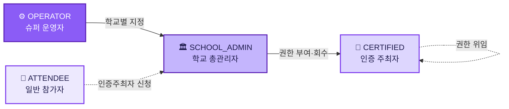
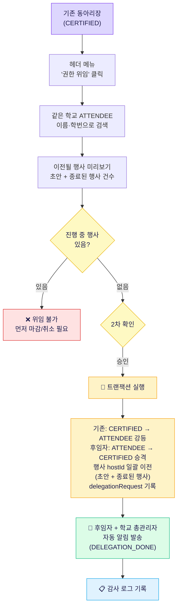
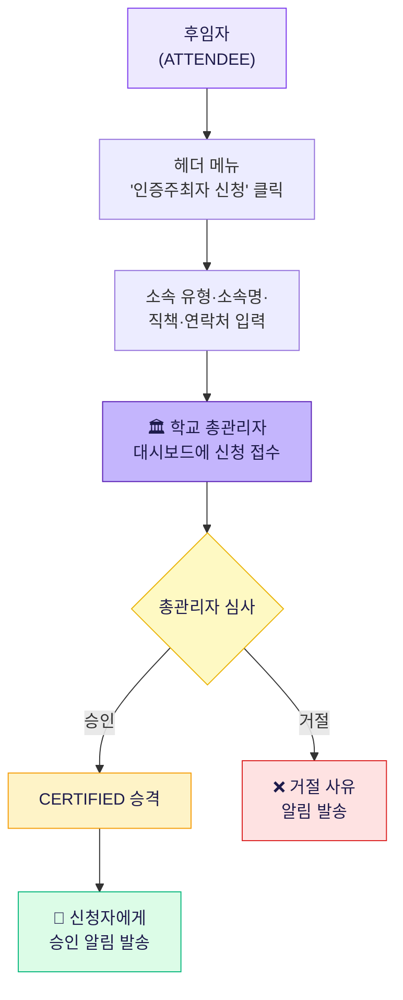
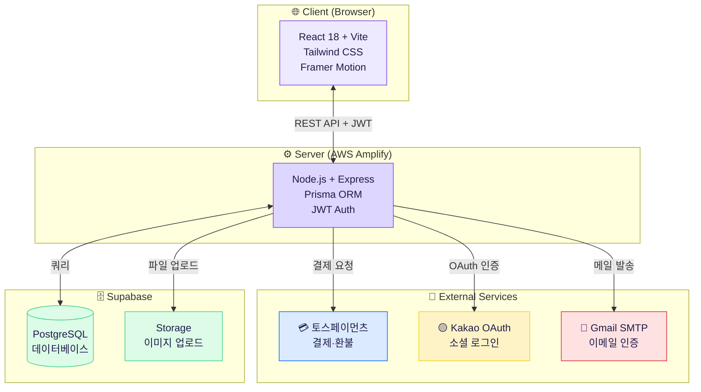

[](https://classroom.github.com/a/Lvs6kcL8)

<div align="center">


### 🎪 페스티켓 (FestiCket) — 대학 축제 참여·관리 올인원 플랫폼

<a href="https://staging.d25a68jt9cg4tx.amplifyapp.com/login">
  
</a>

<p>
  <a href="https://staging.d25a68jt9cg4tx.amplifyapp.com/login">
    
  </a>
  <a href="https://kookmin-sw.github.io/2026-capstone-56/">
    
  </a>
</p>

<p>
  
  
  
  
  
  
  
</p>


</div>

---

## 1. 프로젝트 소개

매 학기 진행되는 수백 개의 캠퍼스 행사들이 여전히 SNS 댓글, 구글 폼, 현장 줄서기로 운영되고 있습니다.
주최자는 참가자 관리에 지치고, 참가자는 정보를 찾기 어렵습니다.

**페스티켓**은 행사 개설부터 참가 신청, 결제, QR 티켓 발급, 현장 체크인까지 전 과정을 하나의 웹 플랫폼에서 해결합니다.

### 핵심 기능

| 기능 | 설명 |
|------|------|
| 🎟️ **QR 티켓** | 신청 즉시 고유 QR 코드 티켓 발급 |
| ⚡ **실시간 체크인** | QR 스캔으로 빠른 현장 입장 처리 |
| ⏱️ **취소표 자동 릴리즈** | 취소 자리를 설정 간격마다 자동 재오픈 (60초 주기 워커) |
|  **간편 결제 & 환불** | 토스페이먼츠 연동 (카드·간편결제·계좌이체), 환불 자동 처리 |
| ✅ **화이트리스트** | 특정 학번 대상 무료·우선 신청 설정, CSV 일괄 업로드 지원 |
| 🏫 **학교 인증** | 대학 이메일 인증으로 소속 확인, 학교별 행사 분리 |
| 📊 **운영 대시보드** | 신청 현황·체크인율·환불 현황 실시간 모니터링 |
| 👥 **공동 호스트** | 행사에 공동 주최자 추가, 팀 단위 운영 가능 |
| 🔔 **알림·공지·문의** | 행사 변경·티켓 확정 알림 / 학교·전체 공지 / 1:1 문의 |
|  **카카오 로그인** | 소셜 로그인 + 학교 이메일 인증 연동 |
| 🛡️ **역할 기반 권한** | 참가자·인증주최자·학교관리자·운영자 4단계 |
| ⭐ **즐겨찾기** | 관심 행사 북마크 및 목록 관리 |
| 💬 **리뷰 & Q&A** | 행사별 별점·후기 작성 / 익명 질문·답변 |
| 📥 **명단 다운로드** | 신청자 명단 XLSX · CSV 내보내기 |
| 🔑 **권한 위임** | 인증주최자가 후임자에게 직접 위임 |

---

## 2. 소개 영상

> 준비 중입니다. 영상이 업로드되면 여기에 추가될 예정입니다.

<!-- 영상 업로드 후 아래 주석을 해제하고 링크를 교체하세요 -->
<!--
[](https://www.youtube.com/watch?v=VIDEO_ID)
-->

---

## 3. Before / After 스토리

페스티켓이 실제로 누구를, 어떻게 편하게 만드는지 구체적인 스토리로 설명합니다.

---

### 🏛️ 학교 총관리자 (총학생회 / 총동아리연합회)


- 자교 내 행사 현황 파악을 위해 **직접 발로 뛰며 조사** 필요
- 행사가 제대로 열리고 있는지, 참가비 관리가 되고 있는지 알 방법이 없음
- **민원이 들어온 뒤에야** 문제를 파악하는 사후 대응 구조
- 어떤 동아리가 어떤 행사를 열었는지 정리된 데이터 부재


- **대시보드 하나**로 자교 행사 전체 목록·개설자·신청 현황·진행 상태를 실시간 확인
- 누가 어떤 행사를 열었고, 참가자가 몇 명인지, 정상 운영 중인지 **한눈에 파악**
- 문제가 생기기 전 **선제적 인지** 가능
- 인증주최자 권한 부여·회수로 적절한 행사 주최자 직접 관리

> **CASE 1 — 행사 운영 과정을 파악하고 싶은 관리자·교수·총학·동아리연합**
> "이 동아리가 이렇게 행사를 운영했구나. 다음 학번 학생들한테 레퍼런스로 보여줄 수 있겠다."

> **CASE 2 — 과정보단 최종 결과만 확인하고 싶은 담당자**
> 각 행사와 인증 사용자의 데이터가 자동으로 누적되므로, 단일 양식의 파일로 다운받아 확인만 하면 됨. 권한은 동아리 단위로 자생적 인수인계가 이루어지므로, 동아리장 공백 시 기존 인증주최자가 후임자에게 직접 위임하는 구조로 운영 가능.

---

### 🎪 인증사용자 (행사 주최자 — 동아리장, 학생회 등)


홍보·신청·결제·관리가 **전부 다른 플랫폼**으로 분산되어 있음:

- 📣 **홍보** — 에브리타임·인스타그램 게시
- 📝 **신청 접수** — 구글 폼
- 💸 **결제** — 계좌이체 요청
- 📒 **명단·납부 확인** — 수기 관리 (엑셀)


**페스티켓 하나로 행사 개설부터 마감까지 완결:**

- 홍보 불필요 → 플랫폼 내 **행사 페이지**가 홍보 역할 대체
- 구글 폼 불필요 → **신청 버튼 하나**로 참가자 모집
- 계좌이체·수기 확인 불필요 → **토스페이먼츠** 자동 결제, 납부 현황 실시간 정리
- **XLSX / CSV 다운로드**로 행정 관리 가능
- **화이트리스트** 기반 학생회비 납부자 필터링 등 현실적 문제 해결
- **취소표 자동 릴리즈**로 대기자도 놓치지 않고 신청 기회 확보

---

### 🙋 참여자 (일반 학생)


- 행사를 직접 찾아야 함 (에브리타임·인스타·카카오톡 각자 따로)
- 행사마다 참여 방식이 달라 **구글 폼 작성 → 계좌 이체 → 확인 연락** 매번 반복
- 몰라서 **신청을 못하는 경우** 빈번


- 에타·인스타·카카오톡 따로 볼 필요 없이 **사이트 내 학교 행사 한 곳에 집결**
- "몰라서 신청 못하는" 경우 사라질 전망
- **클릭 한 번**으로 신청 완료, 즉시 발급된 QR로 입장
- 환불 시 주최자 연락 불필요 → **신청 취소 버튼**으로 간편 처리

---

## 4. 권한별 기능 가이드

페스티켓은 4단계 역할 권한 구조로 운영됩니다.



### 👤 ATTENDEE — 일반 참가자

| 기능 | 설명 |
|------|------|
| 행사 탐색 | 학교·날짜·가격 필터로 행사 검색 |
| 행사 신청 | 클릭 한 번으로 무료·유료 행사 신청 |
| QR 티켓 | 신청 즉시 발급, 내 티켓 탭에서 확인 |
| 알림 수신 | 행사 변경·확정·취소 등 알림 수신 |
| 환불 신청 | 신청 취소 버튼으로 간편 환불 |
| 프로필 관리 | 학교 이메일 인증으로 소속 확인 |
| 즐겨찾기 | 관심 행사 북마크 저장 및 목록 조회 |
| 리뷰 작성 | 참여 완료 행사에 별점·후기 작성 (익명 지원) |
| Q&A | 행사 주최자에게 질문 및 답변 확인 (익명 지원) |
| 1:1 문의 | 학교 관리자에게 문의 접수 |

### 🎪 CERTIFIED — 인증 주최자

ATTENDEE의 모든 기능 포함, 추가로:

| 기능 | 설명 |
|------|------|
| 행사 개설 | 제목·일시·장소·정원·가격·이미지 설정 |
| 행사 관리 | 신청자 목록·체크인율·환불 현황 실시간 확인 |
| QR 체크인 | 카메라로 참가자 QR 스캔 → 즉시 입장 처리 |
| 취소표 릴리즈 | 행사별 릴리즈 간격 설정, 취소 자리 자동 재오픈 |
| 명단 다운로드 | 신청자 명단 XLSX · CSV 내보내기 |
| 화이트리스트 | 학생회비 납부자 등 특정 학번 대상 무료·우선 신청 허용 (CSV 업로드) |
| 공동 호스트 | 행사에 공동 주최자 추가, 팀 단위 운영 |
| Q&A 답변 | 참가자 질문에 답변 |
| 권한 위임 | 후임자에게 CERTIFIED 권한 직접 위임 |

### 🏛️ SCHOOL_ADMIN — 학교 총관리자

CERTIFIED의 모든 기능 포함, 추가로:

| 기능 | 설명 |
|------|------|
| 자교 행사 전체 조회 | 학교 내 모든 행사 현황 한눈에 파악 |
| 인증주최자 관리 | 인증주최자 권한 부여·회수, 신청 승인 |
| 공지사항 관리 | 학교 단위 공지 작성·관리 |
| 문의 처리 | 학생 문의 확인 및 답변 |

### ⚙️ OPERATOR — 슈퍼 운영자

전체 플랫폼 관리:

| 기능 | 설명 |
|------|------|
| 전체 행사 관리 | 모든 학교의 행사 조회·승인·삭제 |
| 전체 사용자 관리 | 역할 변경, 계정 관리 |
| 학교 관리 | 학교 추가·수정, SCHOOL_ADMIN 지정 |
| 감사 로그 | 모든 관리자 행동 이력 조회 |
| 환불 큐 관리 | 환불 요청 일괄 처리 |

---

## 5. 인수인계 가이드

동아리·학생회 특성상 매 학기 담당자가 바뀝니다. 페스티켓은 이를 고려한 인수인계 구조를 갖추고 있습니다.

### 🎪 인증주최자 인수인계

#### 방법 1 — 직접 위임 _(권장)_



#### 방법 2 — 후임자 직접 신청 _(기존 담당자 연락이 어려울 때)_



> 💡 **팁:** 동아리당 인증주최자를 **2명 이상** 등록해두는 것을 권장합니다. 한 명이 갑작스럽게 연락이 닿지 않더라도 나머지 한 명이 권한을 위임할 수 있습니다.

---

### 🏛️ 학교 총관리자 인수인계

**학교 총관리자 권한 이전 절차:**

```
현 총관리자
  → 관리자 대시보드 → 후임자 지정
  → 후임자 확인 → 플랫폼 운영자(OPERATOR) 승인
  → 자동 교체 완료
```

**학기 초 권장 운영 절차:**

> 학교 총관리자님께,
> 매 학기 시작 전, 행사를 개최하는 동아리·학생회로부터 인증주최자 신청 명단을 수집해 권한을 부여해 주세요.
> 동아리당 **2명 이상** 신청을 권장합니다 (비상시 상호 위임을 위해).
> 맨 처음 셋업 이후에는 각 동아리가 자체적으로 인수인계를 진행하므로 총관리자의 개입 없이도 운영됩니다.

---

## 6. 팀 소개

<div align="center">

**국민대학교 소프트웨어융합대학 2026 캡스톤 56팀**

<table align="center">
  <tr>
    <td align="center" width="180">
      <h1>🎨</h1>
      <h3>이한결</h3>
      <code>20235277</code>
      <br/><br/>
      <b>UI/UX 디자인</b><br/>
      <sub>편의 도메인 구현</sub>
    </td>
    <td align="center" width="180">
      <h1>🎪</h1>
      <h3>이주엽</h3>
      <code>20213058</code>
      <br/><br/>
      <b>AWS 인프라</b><br/>
      <sub>행사 관리 도메인 구현</sub>
    </td>
    <td align="center" width="180">
      <h1>💳</h1>
      <h3>이창민</h3>
      <code>20235275</code>
      <br/><br/>
      <b>GIT 관리</b><br/>
      <sub>결제 도메인 구현</sub>
    </td>
    <td align="center" width="180">
      <h1>👥</h1>
      <h3>김준형</h3>
      <code>20235272</code>
      <br/><br/>
      <b>DB 설계</b><br/>
      <sub>사용자 관리 도메인 구현</sub>
    </td>
  </tr>
</table>

</div>

---

## 7. 사용법

### 요구사항

- **Node.js** 18 이상
- **npm** 9 이상
- **PostgreSQL** (Supabase 권장)

### 설치 및 실행

#### 1) 저장소 클론

```bash
git clone https://github.com/kookmin-sw/2026-capstone-56.git
cd 2026-capstone-56
git checkout dev
```

#### 2) 백엔드 설정

```bash
cd backend
npm install
```

`.env.example`을 복사해 `.env`를 생성하고 값을 채웁니다:

```bash
cp .env.example .env
```

```env
PORT=4000
DATABASE_URL="postgresql://..."      # Supabase 연결 URL (pooling)
DIRECT_URL="postgresql://..."        # Supabase 연결 URL (direct)
JWT_SECRET=your_jwt_secret
MAIL_USER=your-email@gmail.com
MAIL_PASS=your_gmail_app_password
FRONTEND_URL=http://localhost:5174
KAKAO_REST_API_KEY=your_kakao_key
TOSS_SECRET_KEY=test_sk_your_key
SUPABASE_URL=https://xxx.supabase.co
SUPABASE_SERVICE_ROLE_KEY=your_key
```

DB 마이그레이션 후 서버 실행:

```bash
npx prisma migrate deploy
npm run dev
```

#### 3) 프론트엔드 설정

```bash
cd ../frontend
npm install
npm run dev
```

브라우저에서 `http://localhost:5174` 접속

#### 4) (선택) 테스트 데이터 생성

```bash
cd backend
node scripts/create-test-user.js
```

### 배포 환경

| 구분 | 서비스 |
|------|--------|
| 프론트엔드 | AWS Amplify |
| 백엔드 | AWS Amplify (Node.js) |
| 데이터베이스 | Supabase (PostgreSQL) |
| 스토리지 | Supabase Storage |
| 결제 | 토스페이먼츠 |

---

## 8. 기술 스택

### 시스템 아키텍처



**Frontend**


**Backend**


**외부 서비스**


### 라이선스

이 프로젝트는 학술 목적으로 제작된 캡스톤 디자인 프로젝트입니다.

---

<div align="center">


**© 2026 페스티켓 · 국민대학교 소프트웨어융합대학 캡스톤 56팀**

[🌐 프로젝트 페이지](https://kookmin-sw.github.io/2026-capstone-56/) · [🚀 데모 사이트](https://staging.d25a68jt9cg4tx.amplifyapp.com/login)


</div>
